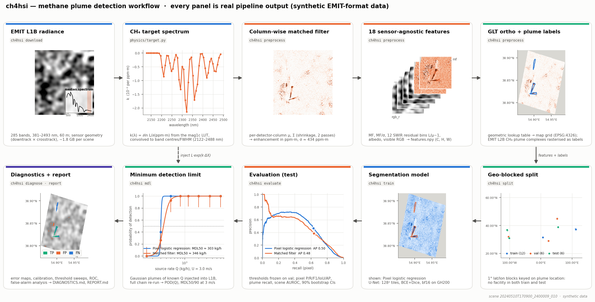
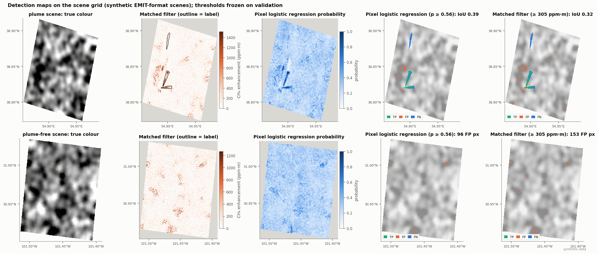
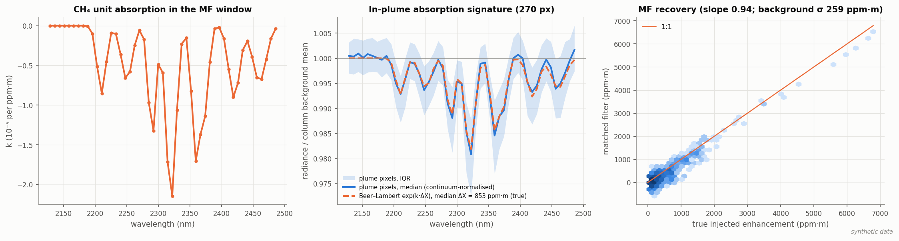
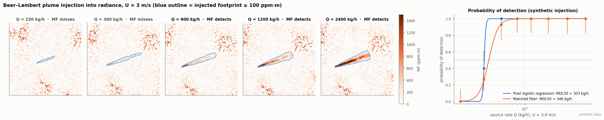
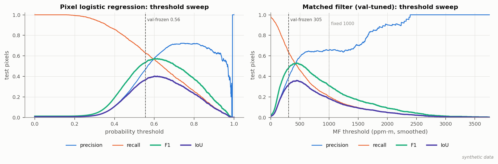
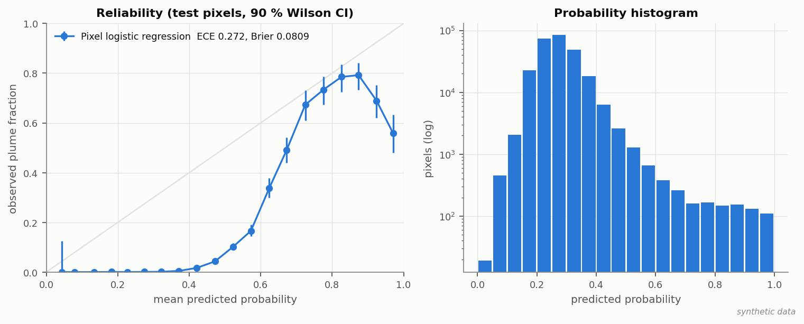
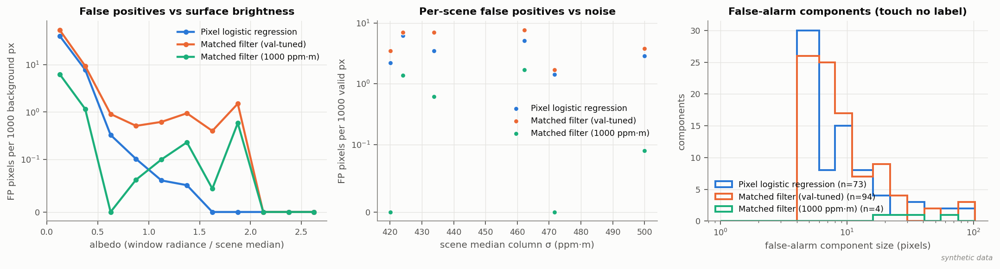

# ch4hsi — methane plume detection in EMIT hyperspectral radiance

Matched-filter baseline + U-Net segmentation on NASA EMIT L1B radiance, labelled with EMIT L2B methane plume
complexes, evaluated with precision/recall, IoU, plume-level and scene-level metrics, and a minimum detection limit from
synthetic plume injection. Built to run end-to-end on **HPC cloud** with Slurm. See [PLAN.md](PLAN.md) for the design.



*Every box shows that stage's actual output for one scene. This version is built from **synthetic**
EMIT-format data (no real scenes are in the repo yet) with the pixel logistic-regression baseline standing
in for the U-Net; regenerate it from a real run with `scripts/make_readme_figures.py` (see [Figures](#figures)).*

## Quick start on HPC cloud (x86 2× V100 or GH200 nodes)

```bash
git clone <your-repo> ~/ch4hsi && cd ~/ch4hsi

# Earthdata credentials (https://urs.earthdata.nasa.gov) for LP DAAC downloads
echo "machine urs.earthdata.nasa.gov login <USER> password <PASS>" >> ~/.netrc && chmod 600 ~/.netrc

bash slurm/submit_all.sh            # builds env for your architecture, preflights egress, then runs every stage
sbatch slurm/smoke.sbatch           # optional: synthetic end-to-end test once the env exists
```

Defaults: auto-detects host architecture (`x86_64` uses `configs/x86_v100.yaml` across 2× V100s; `aarch64` uses
`configs/gh200.yaml`). Overrides go in `slurm/site.env` (see `slurm/site.env.example`); details and resource
tables are in [slurm/README.md](slurm/README.md).

Results land in `$CH4HSI_DATA/runs/<run_name>/`: `REPORT.md` (tables, figures, auto-filled resume bullets),
`metrics_test.json` (with 90% scene-bootstrap CIs), `mdl.json`, `per_scene_test.csv`, `per_plume_test.csv`,
`figures/`, and `diagnostics/DIAGNOSTICS.md` (the full diagnostic figure suite).

## Stages (`python -m ch4hsi <stage> --config ... --set key=value`)

| stage | what it does | output |
|---|---|---|
| `fetch-labels` | plume-complex catalogue (LP DAAC `EMITL2BCH4PLM` or GHG Center STAC) + COG/GeoJSON | `catalog/plumes.csv` |
| `resolve-scenes` | CMR search for the L1B scenes of sampled plumes; plume-free negatives over O&G regions | `catalog/scenes.csv` |
| `download` | resumable, size-checked L1B download (Slurm array) | `raw/*.nc` |
| `preprocess` | column-wise MF, features, GLT ortho, label rasterisation (Slurm array) | `scenes/<id>/*.npy` |
| `split` | geo-blocked train/val/test + normalisation stats | `splits/` |
| `train` | U-Net, AMP, early stopping, resumes from `last.pt` | `runs/<run>/best.pt` |
| `evaluate` | val-tuned thresholds; test metrics for U-Net and MF baselines, 90% bootstrap CIs; figures | `metrics_test.json`, `pr_hist.npz` |
| `diagnose` | diagnostic figure suite (see below) | `diagnostics/DIAGNOSTICS.md` |
| `mdl`, `mdl-fit` | synthetic injection into radiance → POD curves → MDL50/90 | `mdl.json`, `pod_curve.png` |
| `report` | REPORT.md | |
| `baseline-lr` | optional: per-pixel logistic regression on the same features (no spatial context), evaluated + diagnosed; CPU only | `runs/<run>_pixel_lr/` |
| `fetch-enh`, `mf-check` | optional: compare our MF with EMIT L2B CH4ENH | `catalog/mf_crosscheck.json` |
| `aviris-fetch`, `aviris-eval` | experimental cross-sensor test on AVIRIS-NG | `aviris_summary.json` |

Useful overrides: `--set run_name=unet_synth --set train.synth_aug.enabled=true`, `--set features=[mf,mf_snr]`
(MF-only ablation), `--set scenes.max_positive_scenes=150`, `--set labels.source=ghgc_stac`,
`--set train.model=smp` (needs `segmentation_models_pytorch`). With `submit_all.sh`, pass them through
`CH4HSI_EXTRA_SETS="--set ..."` (also works with `slurm/submit_stage.sh <stage>`).

## Figures

All figures below come from `python scripts/make_readme_figures.py` and are **synthetic**: 24 EMIT-like scenes
(285 bands, Gaussian plumes injected with Beer–Lambert, rotated GLT, footprints over real oil & gas regions) pushed
through the real `preprocess → split → evaluate → diagnose` code. Numbers on them are not results. The model panels
show the pixel logistic-regression baseline because torch was not available where they were made; with torch
installed the script trains a quick U-Net instead. On HPC cloud, after a real run:

```bash
python scripts/make_readme_figures.py --config configs/gh200.yaml --run unet_v1   # real scenes + U-Net predictions
python scripts/make_readme_figures.py --model unet                                # synthetic, quick U-Net
```

**Detection maps** on the scene grid (lon/lat): true colour, matched-filter enhancement with the label outline, model
probability, and TP / FP / FN at the thresholds frozen on validation, for a plume scene and a plume-free scene.



**Physics check**: the CH₄ unit-absorption spectrum used as the MF target; the median in-plume radiance ratio
(continuum-normalised) against the Beer–Lambert prediction exp(k·ΔX); and MF-retrieved vs true injected enhancement.



**Minimum detection limit**: one plume-free background with a plume of increasing source rate injected into the
radiance (same source and wind), and probability of detection vs source rate from repeated injections.



### Diagnostics (`ch4hsi diagnose`)

`diagnose` reads what `train`, `evaluate` and `mdl` wrote and produces `runs/<run>/diagnostics/`: training curves,
threshold sweeps (P/R/F1/IoU vs threshold with the val-frozen point), pixel and scene ROC, score distributions,
reliability diagram (ECE, Brier), per-scene IoU (model vs MF), plume recall vs size and strength (Wilson CIs),
false-alarm analysis (vs albedo, noise, component size), MF-vs-model joint density, noise per split, MDL POD vs
source rate / peak ppm·m / scene, a split map, and georeferenced error maps for the best, worst and most
false-alarm-prone scenes, all indexed in `DIAGNOSTICS.md`. Missing inputs just skip that figure. Three examples:





## HPC cloud notes

- GH200 nodes are **aarch64** while gpulogin1 is x86_64, so the job env is built inside a grace job
  (`slurm/00_setup_env.sbatch`, first link of `submit_all.sh`, idempotent). torch comes from the cu128 aarch64
  wheels (fallback: conda-forge `pytorch-gpu`); training uses bf16 on the H100.
- Training stages scenes to node-local `/lscratch` (`train.stage_to_local`), removed at job exit; `train` is
  submitted with `--requeue` and resumes from `last.pt`.
- Re-running `mdl`: delete old `runs/<run>/mdl_records*.csv` first (the fit merges every shard file it finds).

## Tests

```bash
pytest -q tests        # physics (MF recovers injected ppm·m, GLT, plume mass conservation, units), metrics, numpy pipeline,
                       # evaluate + diagnose on in-memory synthetic scenes (no torch needed), U-Net (if torch)
```

## Caveats

- Labels are the EMIT team's reviewed plume complexes: the model learns that delineation, and uncatalogued real plumes
  count as false positives (precision is a lower bound; plume-free scenes give a clean false-alarm rate).
- MDL depends on the assumed wind speed (default 3 m/s) and the idealised plume model; report it with those assumptions.
- The CH4 absorption LUT is taken from the `mag1c` package (BSD-3, Foote et al. 2020).

## References

Thompson et al. 2016 (column-wise MF, AVIRIS-NG); Foote et al. 2020 (mag1c); Thorpe et al. 2023 (EMIT methane);
Varon et al. 2018 (IME flux); Růžička et al. 2023 (STARCOP, ML plume segmentation); EMIT L2B GHG User Guide.
