# Diagnostics — run `unet_v1`

| method | F1 | 90% CI | IoU | 90% CI | plume recall | 90% CI |
|---|---|---|---|---|---|---|
| U-Net | 0.121 | 0.078–0.176 | 0.064 | 0.041–0.096 | 0.652 | 0.552–0.761 |
| Matched filter (val-tuned) | 0.005 | 0.003–0.008 | 0.003 | 0.002–0.004 | 0.826 | 0.760–0.895 |
| Matched filter (1000 ppm·m) | 0.005 | 0.003–0.008 | 0.002 | 0.001–0.004 | 0.783 | 0.706–0.862 |

Calibration: ECE 0.025, Brier 0.0148.

### 01 training_curves

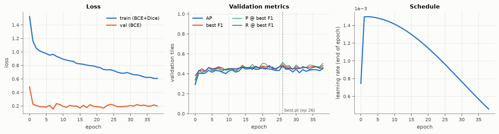

Training loss, validation-tile metrics and LR schedule; dashed line = checkpoint kept as best.pt.

### 02 threshold_sweep

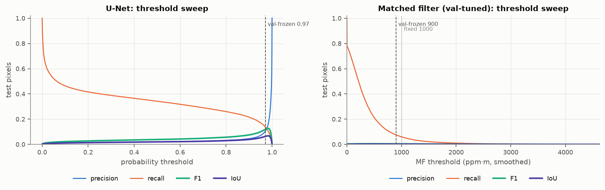

Pixel precision/recall/F1/IoU as a function of threshold on the test split. The dashed line is the threshold frozen on validation; a large gap between it and the test F1 peak signals val/test shift.

### 03 roc

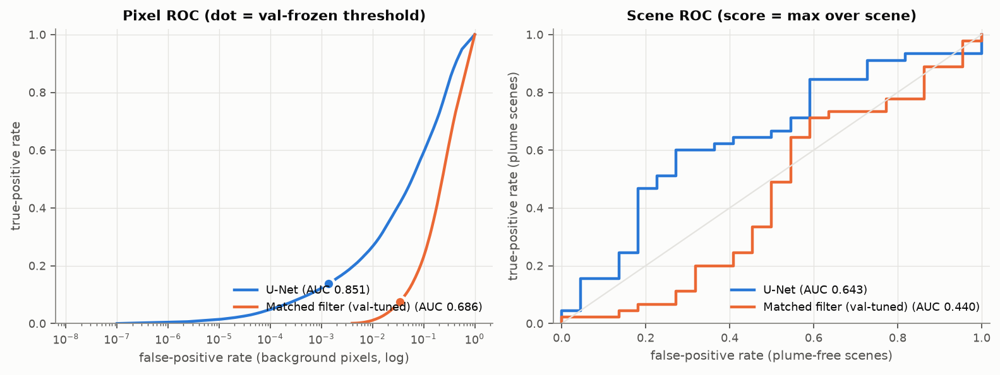

Left: pixel-level ROC with log FPR (plume pixels are rare, so the low-FPR end is what matters). Right: scene-level ROC for flagging scenes that contain a plume.

### 04 score_distributions

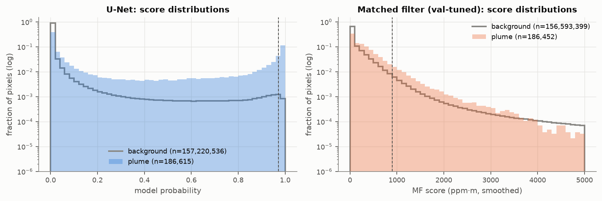

Test-pixel score histograms, plume vs background (dashed = val-frozen threshold). Overlap is the irreducible confusion at pixel level.

### 05 reliability

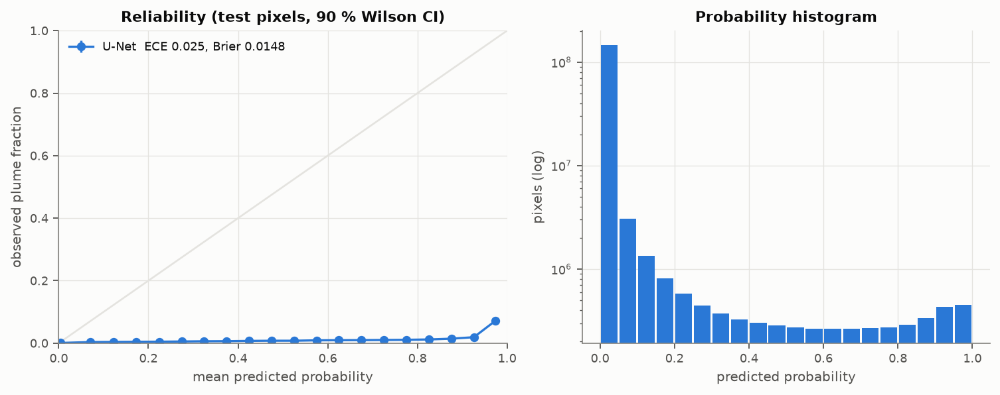

Calibration of the model probability. Pos-weighted BCE + Dice usually makes the network over-confident; this matters if probabilities are used for flux or alerting, not for the thresholded masks.

### 06 per_scene_iou

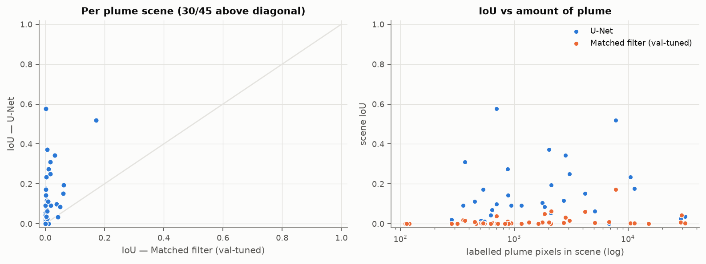

Scene-by-scene IoU. Points below the diagonal are scenes where the matched filter beat the model — good candidates for the error maps.

### 07 plume_detection

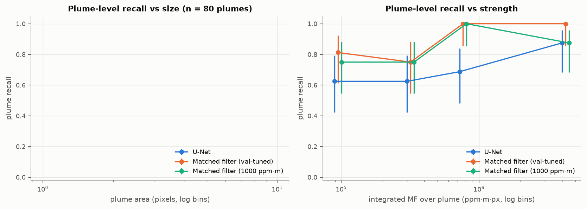

Plume-complex recall (≥1 detected pixel) in quantile bins of area and integrated MF, with 90 % Wilson intervals. The strength panel is the empirical analogue of the MDL POD curve.

### 08 false_alarms

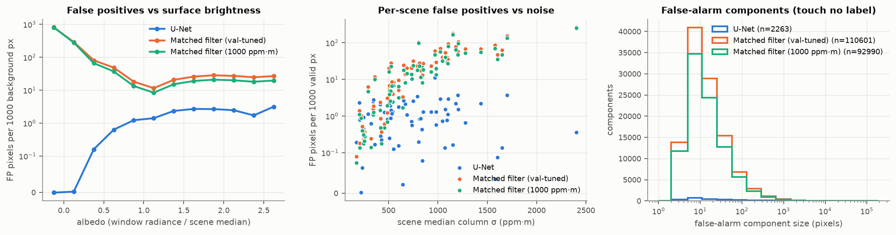

Where false alarms come from. MF false positives classically rise over bright or spectrally unusual surfaces; a learned model should flatten the albedo curve. Remember uncatalogued real plumes also count as FPs here.

### 09 mf_vs_model

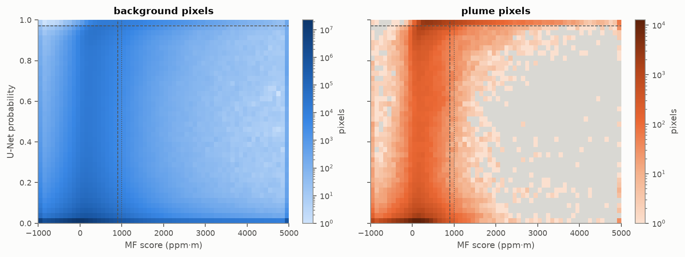

Joint density of MF score and model probability on test pixels (dashed: val-frozen thresholds; dotted: fixed MF threshold). Background mass above the horizontal line and left of the vertical line = model-only false alarms; plume mass below/right = what the model adds or loses versus MF.

### 10 noise

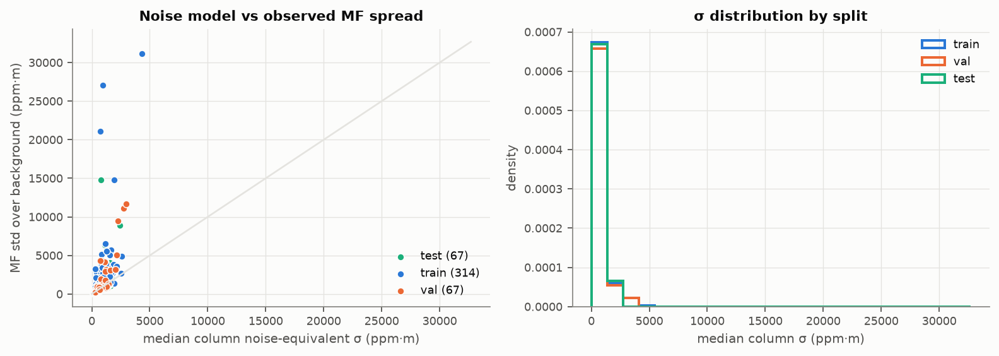

Left: observed MF background spread vs the filter's own noise estimate σ = (tᵀC⁻¹t)^-½ (points far above the diagonal = surface clutter / non-Gaussian background). Right: σ by split — train and test should overlap.

### 11 mdl

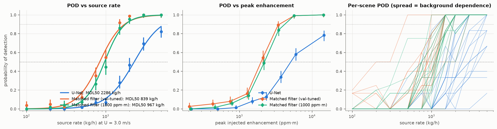

Synthetic-injection detection. The per-scene panel shows how much the MDL depends on the background scene; the peak-ppm·m panel removes the wind/plume-model assumption.

### 12 split_map

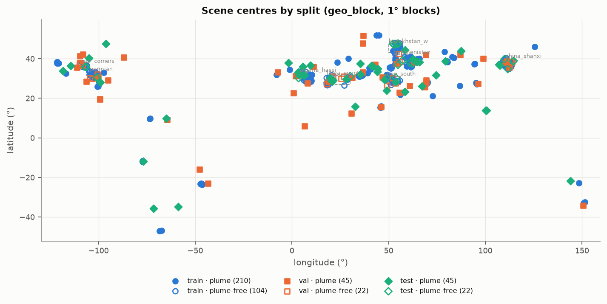

Scene locations by split (filled = plume scenes, open = plume-free; dashed boxes = hard-negative regions). With geo_block splitting no block should host two splits.

### Error maps

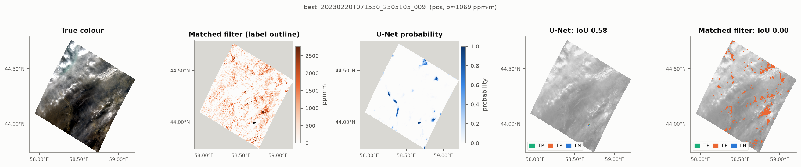
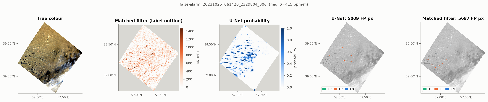
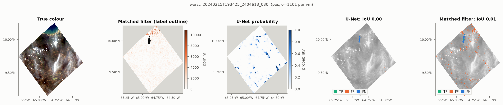
