# Methane plume detection — run `unet_v1`

## Data

| split | scenes | with plumes | plume-free | plume pixels |
|---|---|---|---|---|
| train | 314 | 210 | 104 | 1858993 |
| val | 67 | 45 | 22 | 176726 |
| test | 67 | 45 | 22 | 186615 |

## Test metrics (thresholds frozen on validation)

| method | threshold | pixel P | pixel R | F1 | IoU | AP | plume R | plume P | scene AUROC | FA / 1000 km² |
|---|---|---|---|---|---|---|---|---|---|---|
| U-Net | 0.97 | 0.108 | 0.136 | 0.121 | 0.064 | 0.057 | 0.652 | 0.040 | 0.643 | 4.93 |
| Matched filter (val-tuned) | 900 | 0.003 | 0.075 | 0.005 | 0.003 | 0.002 | 0.826 | 0.002 | 0.440 | 167.61 |
| Matched filter (fixed) | 1000 | 0.003 | 0.059 | 0.005 | 0.002 | 0.002 | 0.783 | 0.003 | 0.440 | 138.45 |

## Minimum detection limit (synthetic injection, U = 3.0 m/s, 1200 injections in 20 plume-free test scenes)

| method | MDL50 (kg/h) | 90% CI | MDL90 (kg/h) | 90% CI | MDL50 peak (ppm·m) |
|---|---|---|---|---|---|
| U-Net | 2286 | 2153–2455 | 5484 | 4901–6282 | 5263 |
| Matched filter (val-tuned) | 839 | 787–885 | 1732 | 1550–1901 | 1842 |
| Matched filter (fixed) | 967 | 913–1022 | 1777 | 1630–1928 | 2130 |

Median column noise-equivalent enhancement σ = 627 ppm·m; analytic 3σ / 9-pixel MDL ≈ 2616 kg/h.

90% scene-bootstrap confidence intervals:

| method | F1 | IoU | plume recall | plume precision |
|---|---|---|---|---|
| U-Net | 0.08–0.18 | 0.04–0.10 | 0.55–0.76 | 0.03–0.06 |
| Matched filter (val-tuned) | 0.00–0.01 | 0.00–0.00 | 0.76–0.89 | 0.00–0.00 |
| Matched filter (fixed) | 0.00–0.01 | 0.00–0.00 | 0.71–0.86 | 0.00–0.00 |

## Figures

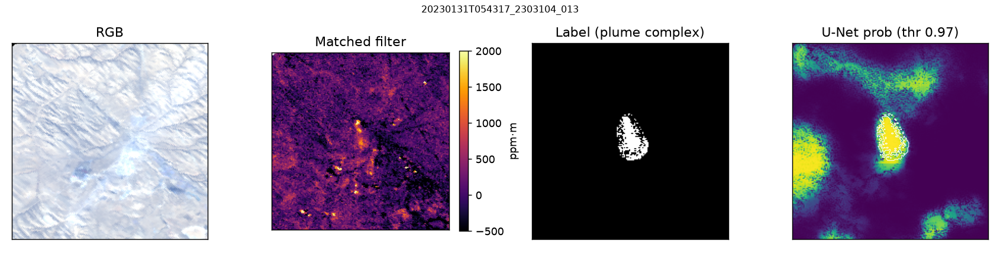
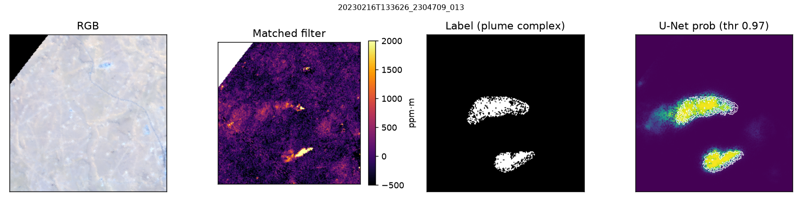
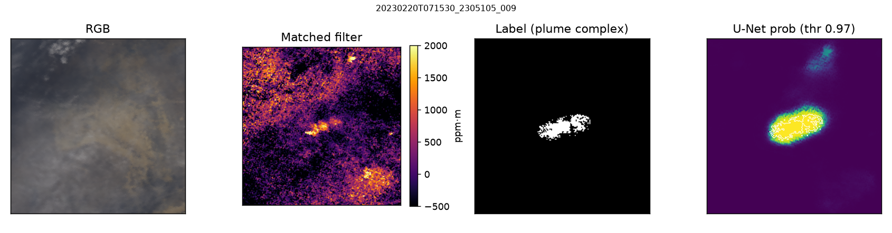
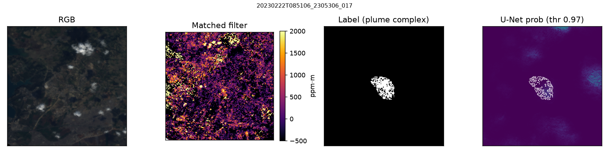
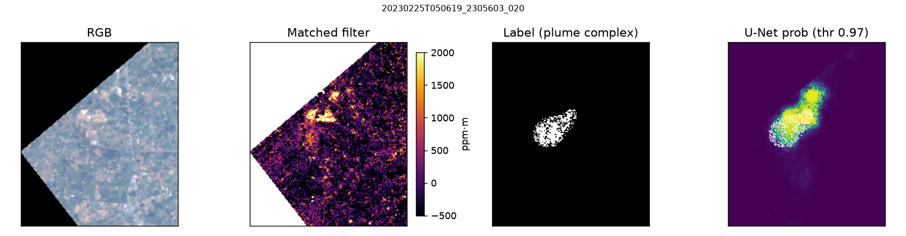
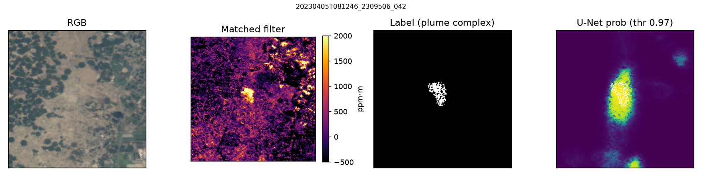
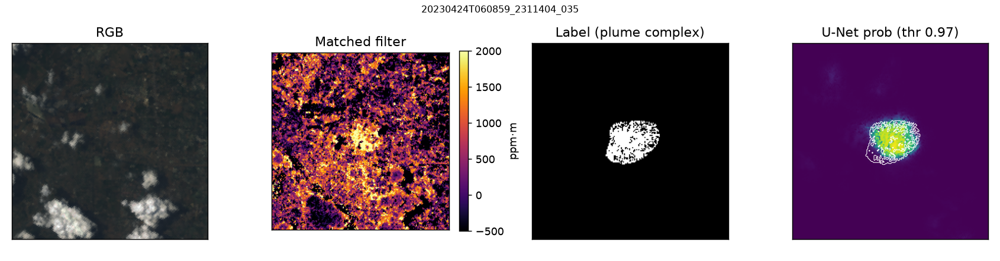
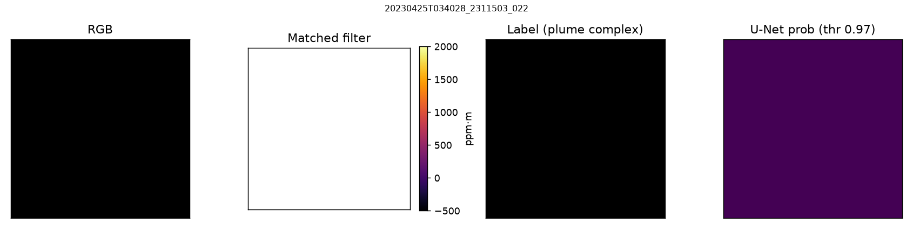
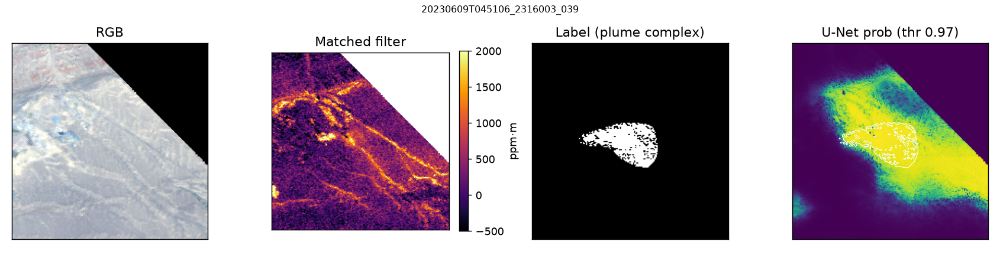
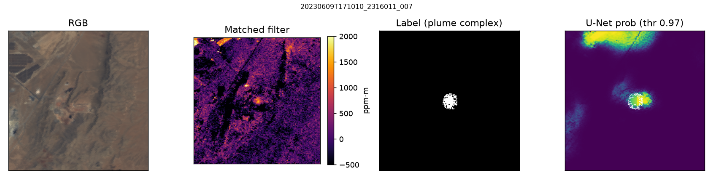
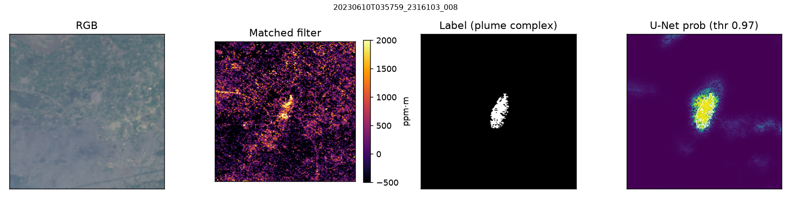
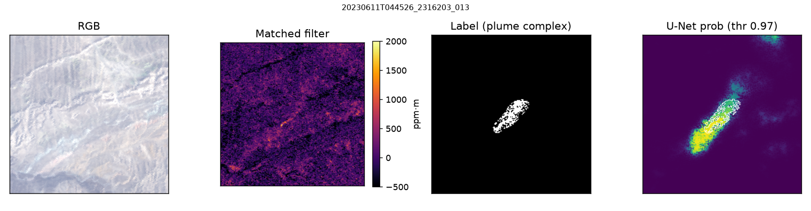
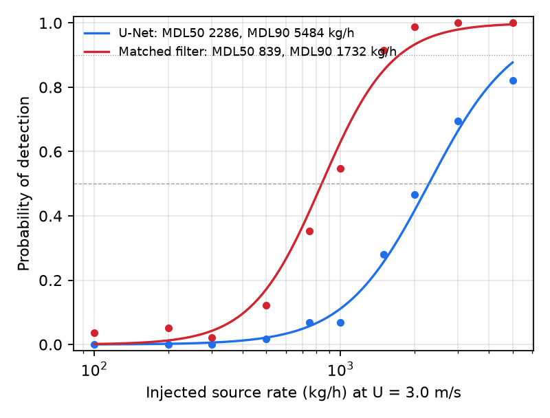
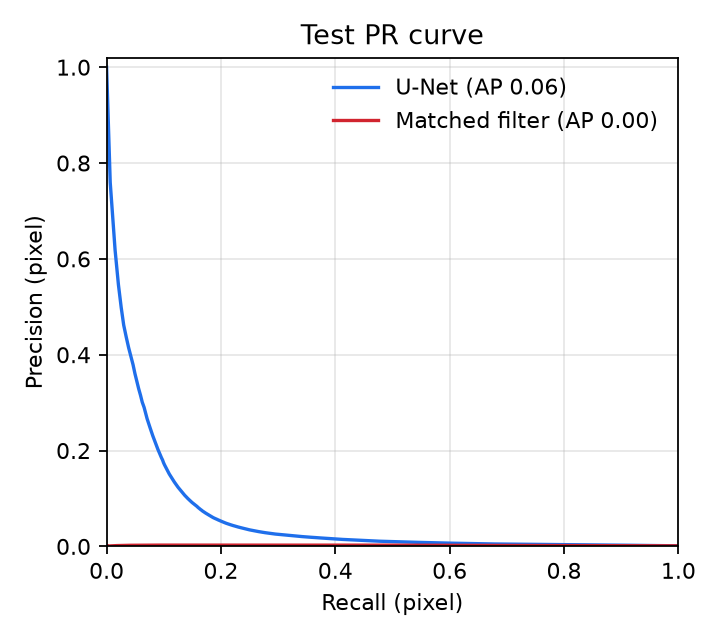
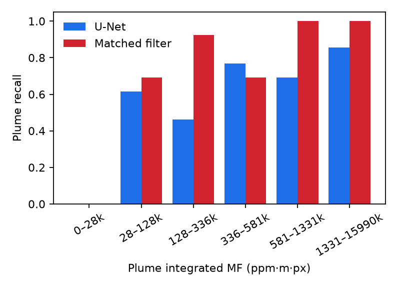

Full diagnostic suite (training curves, threshold sweeps, ROC, calibration, error maps, false-alarm analysis): [diagnostics/DIAGNOSTICS.md](DIAGNOSTICS.md)

## Resume bullets (auto-filled)

- Built an end-to-end methane plume detection pipeline on NASA EMIT L1B imaging-spectrometer radiance (column-wise matched filter → sensor-agnostic spectral features → U-Net segmentation), trained on 210 scenes with EMIT L2B plume-complex labels on NCCS Prism GPUs.
- On geographically held-out scenes: pixel F1 0.12 / IoU 0.06 for the U-Net vs 0.01 / 0.00 for the tuned matched-filter baseline; plume-level recall 0.65 at precision 0.04.
- Quantified a minimum detection limit of ~2286 kg/h (50% POD; 5484 kg/h at 90%) at 3.0 m/s via Beer–Lambert plume injection into radiance, vs 839 kg/h for the matched filter.
